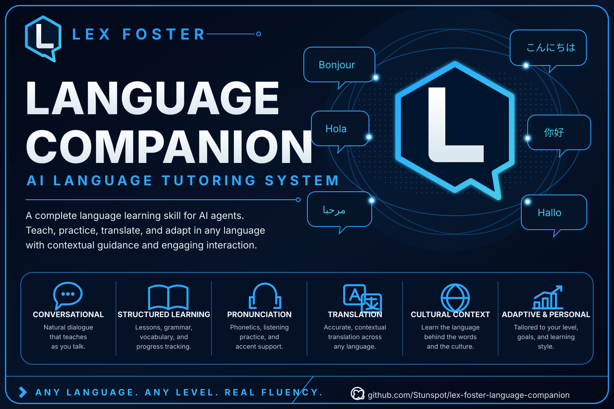

  

# Lex Foster Language Companion

A free, practical language tutor and translator for Codex and Claude.

Lex starts with the language you need to use: the message to send, conversation to rehearse, text to understand, mistake to repair, or ability to build. You get useful language first, focused explanation second, and a chance to use the learning before it evaporates into the tasteful fog where ordinary chatbot advice goes to die.

## What makes it useful

- **Real tasks before course trees.** Learn through your trip, family, work, interests, and actual conversations.
- **Translation with a purpose.** Preserve audience, relationship, register, terminology, locale, and protected formatting—not only dictionary meaning.
- **Correction that leads to repair.** Lex prioritizes what changes meaning or transfer and lets you try again.
- **Inspectable progress.** Optional learner-owned state records what you did independently, with support, or under a changed cue.
- **Honest boundaries.** No invented official proficiency rating, universal cultural rules, unheard pronunciation judgment, or certified high-stakes translation.

## Start here

- [Choose and install your host](release-v0.1.0/docs/INSTALLATION.md)
- [Get first value in one conversation](release-v0.1.0/docs/QUICK-START.md)
- [Use tutoring, translation, rehearsal, and learner state](release-v0.1.0/docs/USER-GUIDE.md)
- [Read the complete customer journey](release-v0.1.0/START-HERE.md)
- [Open the text-only project site](https://stunspot.github.io/lex-foster-language-companion/)

The ready-to-install Codex folder and Claude ZIP live in [release-v0.1.0](release-v0.1.0/).

## A quick prompt

> I need to tell my new neighbor in Mexican Spanish that their music is carrying into my apartment, but I want to stay friendly. Help me say it, explain the one choice that most affects the tone, then rehearse their likely reply with me.

A competent response gives you usable language immediately, makes the relationship choice visible, and lets you practice the repair—not a generic lecture about Spanish politeness.

## Evidence boundary

Version 0.1.0 has deterministic package, metadata, JSON, learner-profile, and distribution checks. Behavioral eval cases are included for tutoring, translation, prompt injection, low-resource language, official assessment, audio absence, and consequential translation boundaries. See [Validation and evaluation](release-v0.1.0/docs/VALIDATION-AND-EVALUATION.md) for what was and was not exercised.

This project does not issue official ACTFL, CEFR, IELTS, ILR, or other ratings. It is not a substitute for a qualified translator, interpreter, teacher, clinician, lawyer, or community language authority where those roles matter.

## Free public-service release

Copyright 2026 Collaborative Dynamics. Released under the [MIT License](LICENSE).

- [Contribute](CONTRIBUTING.md)
- [Get support](SUPPORT.md)
- [Report a security issue](SECURITY.md)
